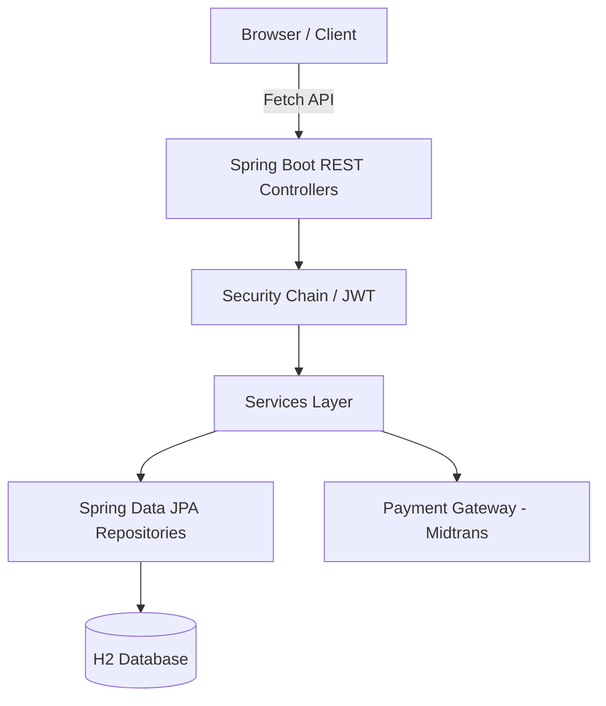

<div align="center">

# ⚽ FootballTix – Football Ticket Booking System

[](https://spring.io/projects/spring-boot)
[](https://www.oracle.com/java/)
[](https://tailwindcss.com/)
[](LICENSE)

**FootballTix** is a modern, end-to-end platform for booking football match tickets. Built with Spring Boot 3, it offers a seamless experience for fans, admins, and cashiers.


[**ID: Ringkasan**](#id-ikhtisar-sistem) | [**EN: Overview**](#2-system-overview) | [**Quick Start**](#4-getting-started)

---

</div>

## 1. ID: Ikhtisar Sistem
Platform pemesanan tiket sepak bola end-to-end berbasis Spring Boot 3 dengan antarmuka modern (Tailwind + JS) dan persistensi data H2.

- **Fitur Utama**:
  - 🏆 Kelola Liga & Event (CRUD).
  - 🎫 Pemesanan Tiket (Virtual) dengan kuota kursi dinamis.
  - ❤️ Wishlist & Notifikasi UI.
  - 🔐 Autentikasi JWT & Google OAuth ready.
  - 💳 Integrasi Midtrans Payment Gateway (Placeholder).
  - 📊 Dashboard untuk Admin, Kasir, dan User.

---

## 2. System Overview
An end-to-end football ticketing platform powered by Spring Boot 3, Tailwind, and a persistent H2 datastore.

- **Key Highlights**:
  - **Secure**: JWT-based authentication with strict password policies.
  - **Scalable Architecture**: Service-oriented design with decoupled frontend.
  - **User-Centric**: Responsive UI for mobile and desktop match booking.
  - **Audited**: Security monitoring and activity logging.

---

## 3. Architecture



---

## 4. Getting Started

### Prerequisites
- Java 17+
- Maven 3.6+
- Browser modern

### Installation
1. Clone the repository:
   ```bash
   git clone https://github.com/AM4517U/Football-Ticket.git
   cd Football-Ticket
   ```
2. Build and run:
   ```bash
   mvn spring-boot:run
   ```
3. Access the app: [http://localhost:8080](http://localhost:8080)

### Default Accounts (Dev)
| Role    | Username | Password     |
|---------|----------|--------------|
| **ADMIN**   | `Alogo12`  | `Alogo.situ24` |
| **CASHIER** | `cashier1` | `Alogo.situ24` |

---

## 5. API Reference (Core)

| Method | Endpoint | Description |
|--------|----------|-------------|
| `GET`  | `/api/events` | List all events |
| `GET`  | `/api/events/{id}` | Match details |
| `POST` | `/api/auth/login` | JWT Authentication |
| `POST` | `/api/bookings` | Create a booking |
| `GET`  | `/api/wishlist` | User favorites |

---

## 6. Project Structure
```text
src/main/java/com/example/ticketbooking
├── config/       # Security, Midtrans, Data Init
├── controller/   # REST Endpoints
├── dto/          # Data Transfer Objects
├── entity/       # Database Entities
├── repository/   # JPA Access
├── security/     # JWT & OAuth Logic
└── service/      # Business Logic
```

---

## 7. Contributing
1. Fork the project.
2. Create your feature branch (`git checkout -b feature/AmazingFeature`).
3. Commit your changes (`git commit -m 'Add AmazingFeature'`).
4. Push to the branch (`git push origin feature/AmazingFeature`).
5. Open a Pull Request.

---

<div align="center">

**FootballTix – Experiencing the stadium, simplified.**

Built by the FootballTix Team.

</div>
